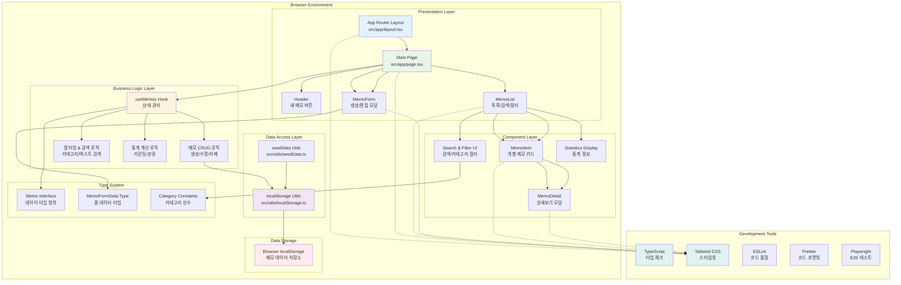

# 메모 앱 시스템 아키텍처

## 개요

이 다이어그램은 Next.js 기반의 메모 앱의 전체 시스템 아키텍처를 보여줍니다. 클라이언트 사이드 렌더링을 통해 localStorage를 활용한 완전한 프론트엔드 솔루션입니다.

## 다이어그램

## 설명

### 주요 레이어별 설명

#### 1. Presentation Layer (프레젠테이션 레이어)
- **App Router Layout**: Next.js 15 App Router를 사용한 기본 레이아웃
- **Main Page**: 메인 페이지로 모든 컴포넌트들을 조합
- **헤더**: 앱 제목과 새 메모 생성 버튼
- **모달 시스템**: 메모 생성/편집과 상세보기를 위한 모달

#### 2. Component Layer (컴포넌트 레이어)
- **MemoList**: 메모 목록을 표시하고 검색/필터링 기능 제공
- **MemoItem**: 개별 메모를 카드 형태로 렌더링
- **MemoDetail**: 메모의 전체 내용을 모달로 표시
- **MemoForm**: 메모 생성 및 편집을 위한 폼 컴포넌트

#### 3. Business Logic Layer (비즈니스 로직 레이어)
- **useMemos Hook**: React 상태 관리 및 모든 메모 관련 비즈니스 로직
- **CRUD 로직**: 메모의 생성, 읽기, 수정, 삭제 처리
- **필터링 로직**: 카테고리별 필터링 및 텍스트 검색
- **통계 로직**: 메모 개수, 카테고리별 분포 등 계산

#### 4. Data Access Layer (데이터 접근 레이어)
- **localStorage Utils**: 브라우저 localStorage와의 인터페이스
- **seedData Utils**: 초기 샘플 데이터 생성 및 관리

#### 5. Type System (타입 시스템)
- **Memo Interface**: 메모 데이터의 타입 정의
- **MemoFormData**: 폼 데이터의 타입 정의
- **Category Constants**: 메모 카테고리 상수 및 타입

### 데이터 흐름

1. **초기 로드**: seedData → localStorage → useMemos → UI 렌더링
2. **메모 생성**: MemoForm → useMemos → localStorage → UI 업데이트
3. **검색/필터링**: SearchInput → useMemos → 필터링 로직 → 결과 표시
4. **메모 수정**: MemoForm → useMemos → localStorage → UI 업데이트
5. **메모 삭제**: DeleteButton → useMemos → localStorage → UI 업데이트

### 기술 스택

- **Frontend**: Next.js 15.4.4, React 19.1.0, TypeScript
- **스타일링**: Tailwind CSS 4
- **상태 관리**: React Hooks (useState, useEffect, useMemo, useCallback)
- **데이터 저장**: Browser localStorage
- **개발 도구**: ESLint, Prettier, Playwright

### 특징

- **서버리스**: 완전한 클라이언트 사이드 애플리케이션
- **반응형**: Tailwind CSS를 활용한 모바일 친화적 디자인
- **타입 안전**: TypeScript로 타입 안전성 보장
- **컴포넌트 기반**: 재사용 가능한 React 컴포넌트 구조
- **실시간 검색**: 입력과 동시에 필터링되는 검색 기능

## 참고사항

이 아키텍처는 로컬 데이터 저장에 의존하므로 브라우저 간 데이터 동기화가 필요한 경우 백엔드 API 통합을 고려해야 합니다.